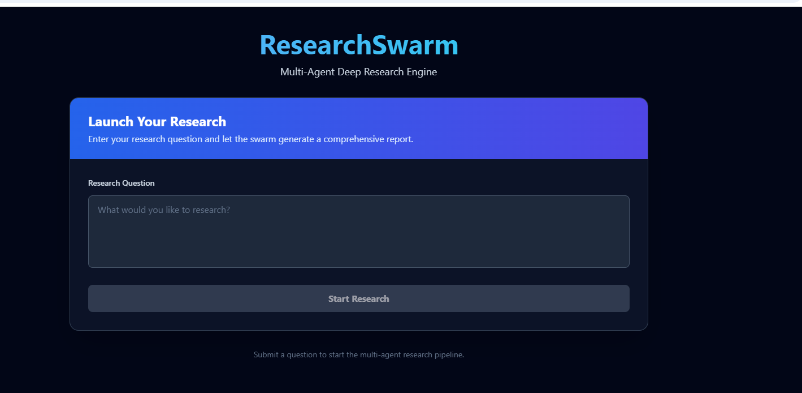
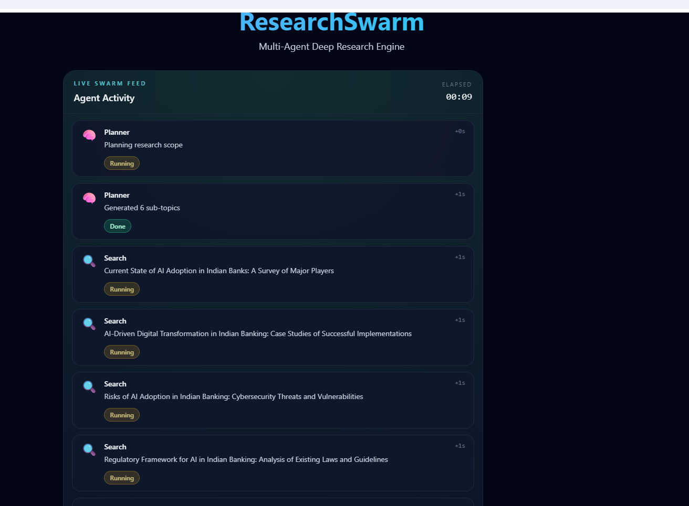
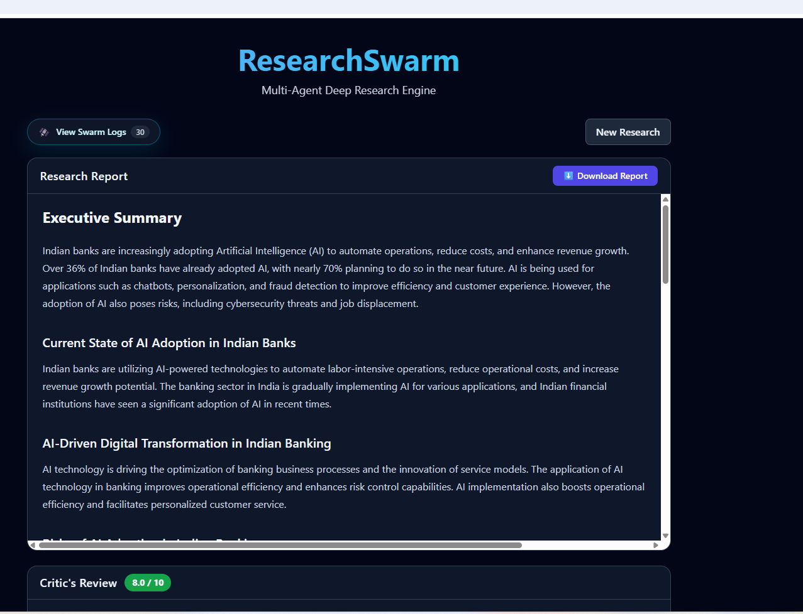
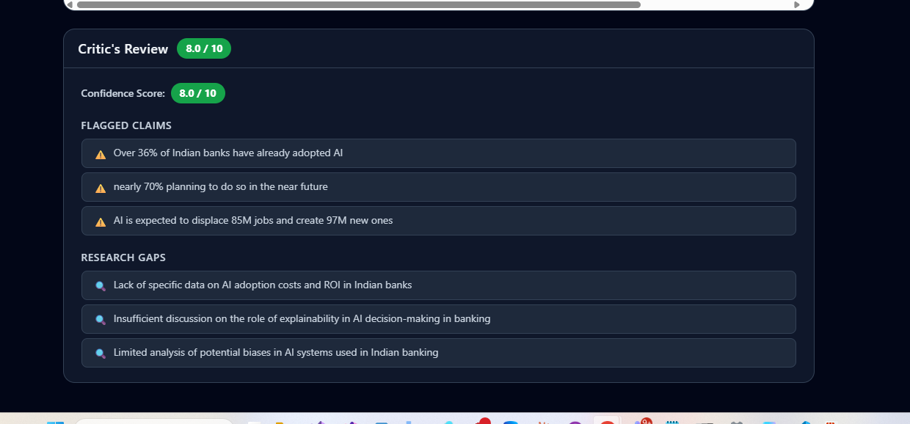

# ResearchSwarm: Multi-Agent Deep Research Engine

ResearchSwarm is a Python + React system that orchestrates a swarm of specialized AI agents to investigate a question end-to-end.

Instead of one-shot generation, ResearchSwarm splits work across focused stages:
- Planner: breaks a question into sub-topics
- Search: gathers source candidates per sub-topic
- Reader: extracts structured insights from sources
- Synthesis: composes a single report
- Critic: evaluates report quality and confidence

The backend now includes rich, colored console logs for each agent and a final workflow summary banner.

## Architecture


*Multi-agent pipeline: Planner → Search → Reader → Synthesis → Critic.*

## Screenshots

### Home — Launch Interface

*Enter your research question and launch the multi-agent swarm.*

### Live Swarm Feed — Agents Running

*Parallel Search and Reader agents reporting status in real time.*

### Research Report — Page 1

*Synthesized markdown report with citations, streamed as soon as Synthesis completes.*

### Research Report — Page 2

*Continued report output with conclusions and source references.*

---

## Prerequisites

- Python 3.10+
- Node.js 18+
- API keys in `.env`:
	- `GROQ_API_KEY`
	- `TAVILY_API_KEY`

## Backend Setup

1. Create and activate a virtual environment.
2. Install dependencies.

```powershell
python -m venv .venv
.\.venv\Scripts\Activate.ps1
pip install -r requirements.txt
```

## Frontend Setup

```powershell
cd frontend
npm install
```

## Run The Servers

Run backend API from repository root:

```powershell
$env:PYTHONPATH = "."
uvicorn core.api:app --reload
```

Run frontend dev server in a second terminal:

```powershell
cd frontend
npm run dev
```

Default endpoints:
- Backend: `http://localhost:8000`
- Frontend: `http://localhost:5173`

---

## Deployment

ResearchSwarm is deployed using two free platforms:

- **Backend API** → [Render](https://render.com)
- **Frontend UI** → [Vercel](https://vercel.com)

### Live URLs
- 🌐 Frontend: https://research-swarm-multi-agent-deep-res.vercel.app
- ⚙️ Backend API: https://researchswarm-multi-agent-deep-research.onrender.com
- 📖 API Docs: https://researchswarm-multi-agent-deep-research.onrender.com/docs

### Backend — Render Setup

1. Go to [render.com](https://render.com) → New → Web Service
2. Connect your GitHub repository
3. Render auto-detects `render.yaml` — no manual config needed
4. Add environment variables under **Environment**:
	- `GROQ_API_KEY` = your Groq API key
	- `TAVILY_API_KEY` = your Tavily API key
5. Click **Deploy**

> ⚠️ Free tier spins down after 15 minutes of inactivity.
> First request may take 30–50 seconds to wake up.
> Open the `/health` endpoint before your demo to warm it up.

### Frontend — Vercel Setup

1. Go to [vercel.com](https://vercel.com) → New Project
2. Connect your GitHub repository
3. Set **Root Directory** to `frontend`
4. Add environment variable:
	- `VITE_API_URL` = your Render backend URL
5. Click **Deploy**

> Vercel auto-deploys on every push to main branch.

### Environment Variables Summary

| Variable | Platform | Description |
|----------|----------|-------------|
| `GROQ_API_KEY` | Render | Groq LLM API key |
| `TAVILY_API_KEY` | Render | Tavily web search API key |
| `VITE_API_URL` | Vercel | Backend API base URL |

## Optional CLI Run

From repository root:

```powershell
python main.py "What are the most promising battery technologies for grid storage in 2030?"
```

Generated report is saved to `output/report.md`.
 

 https://researchswarm-multi-agent-deep-research.onrender.com/docs